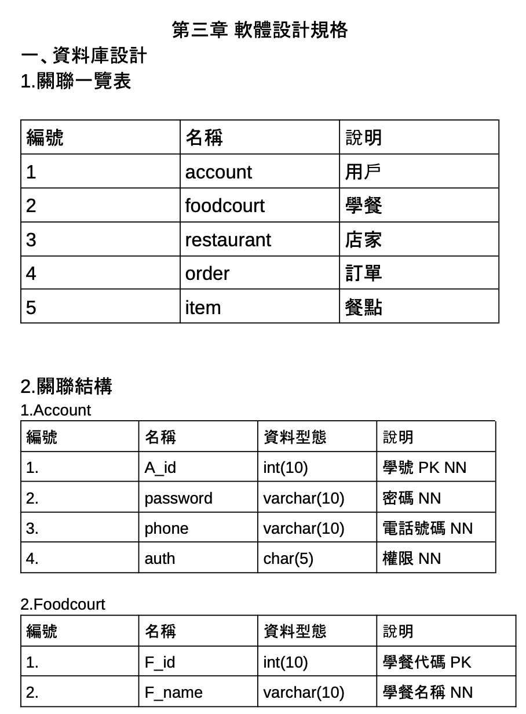
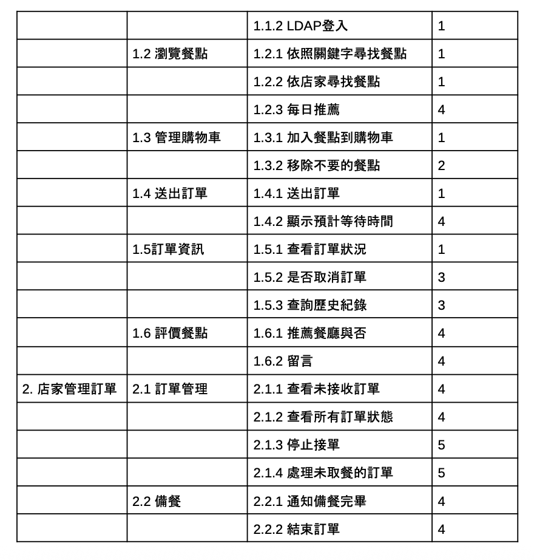
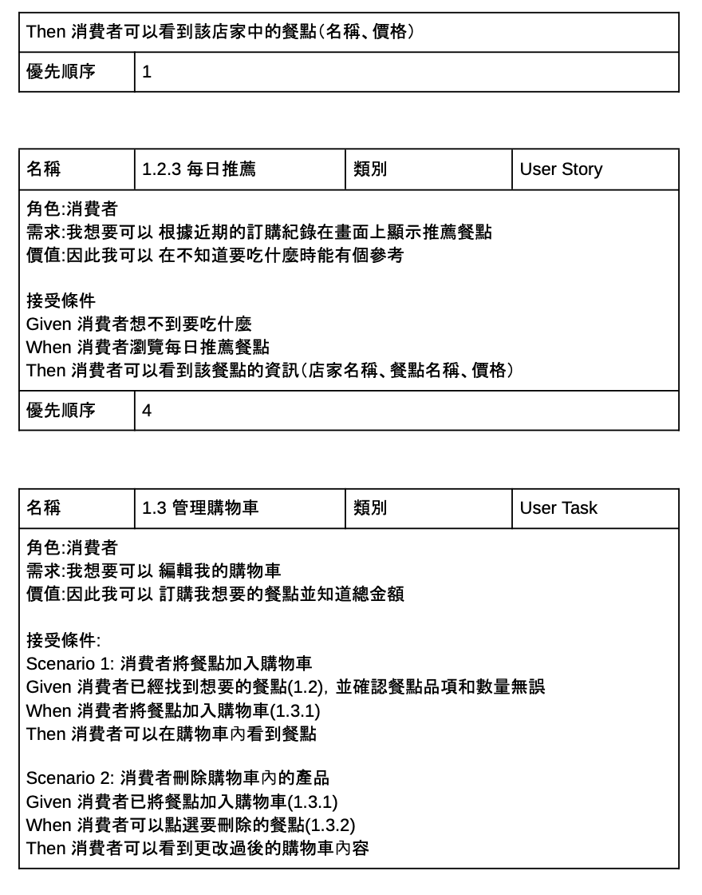
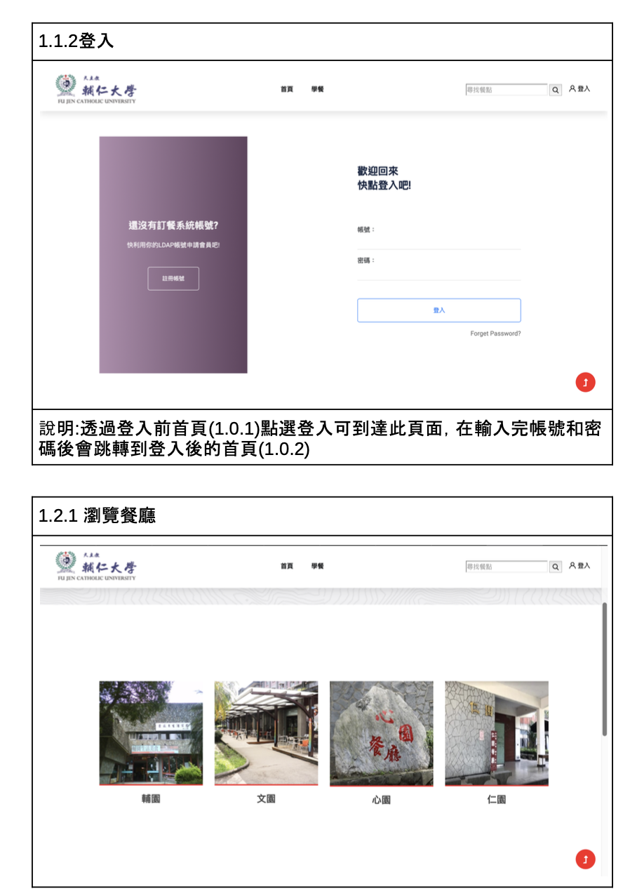
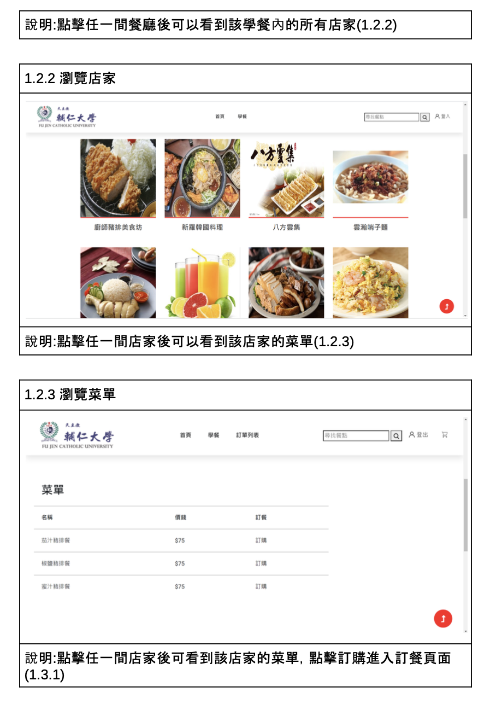
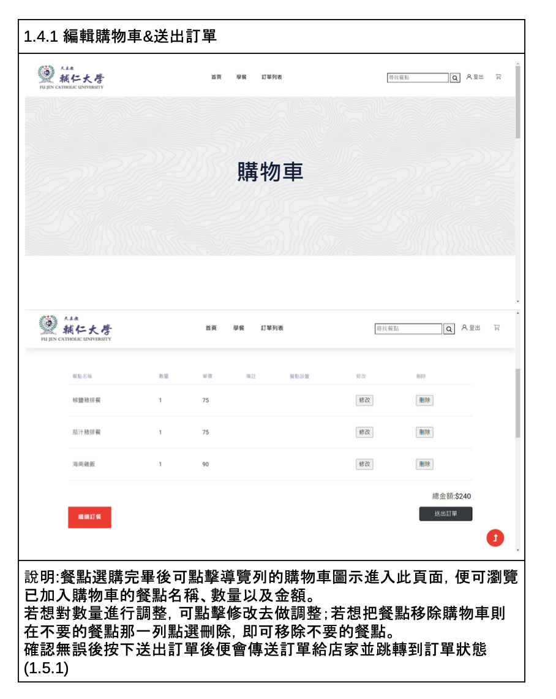
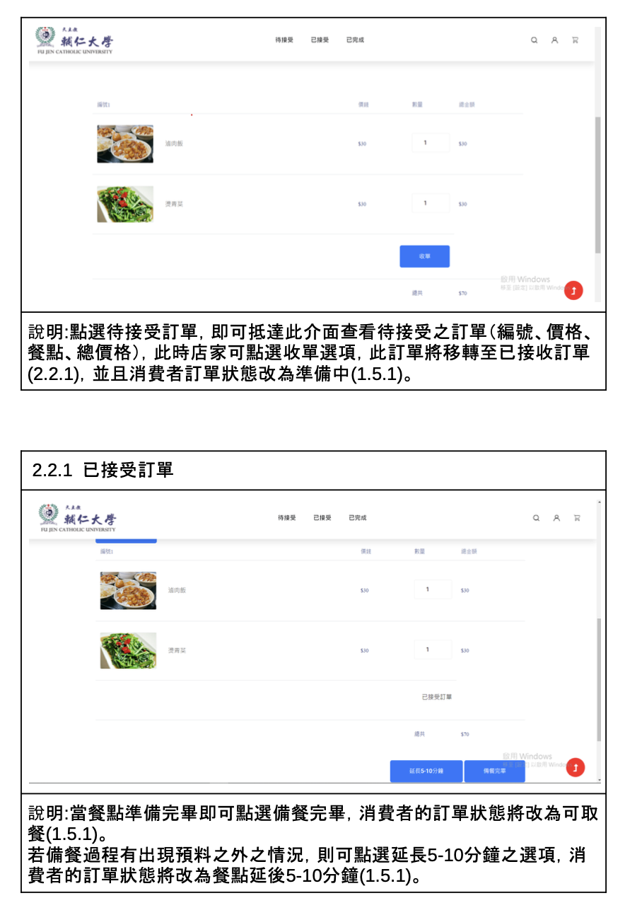

# Campus Food Ordering Platform
校園線上訂餐系統開發規格書專案  
System Specification Project for a Campus Online Food Ordering Platform

---

## Overview  
本專案旨在設計一套可於校園內部運作的線上訂餐平台，支援用戶選擇餐廳、瀏覽菜單、下單與查詢訂單狀態。設計背景源於疫情期間校園內需減少群聚與接觸風險，因此希望以資訊系統方式取代傳統排隊點餐流程。
本系統由使用者端、商家端與後台管理端構成，分別支援學生下單、商家接單與備餐、以及管理員審核餐廳資訊等功能。
系統中也特別設計了訂單紀錄、分類瀏覽與後台審核流程，並在規格書中以 user story、功能流程圖與資料庫 schema 等方式完整描述需求與設計。

This project aims to design an internal online food ordering platform for campus environments, enabling users to select vendors, browse menus, place orders, and track order status. The platform was conceptualized during the COVID-19 pandemic, aiming to reduce physical contact and long queues by digitizing the food ordering process on campus.
The system architecture consists of three primary roles: users (students), vendors (restaurants), and administrators. Students can place orders and review past records, vendors manage incoming orders and update meal statuses, and administrators are responsible for vendor approval and system maintenance.
The system specification document provides detailed user stories, functional flowcharts, and database schemas to illustrate the full design scope and logic of the platform.

---

## Features & System Modules 系統功能與模組

- 用戶角色與互動流程設計  
  Role-based User Stories and Flow Design

- 資料庫設計（ERD、Schema）  
  Database Design (ERD & Schema)

- 系統架構圖與功能分層  
  System Architecture and Functional Layering

- 用戶故事與流程圖  
  User Stories and Interaction Flowcharts

- 系統整體規格說明書  
  Full System Specification Document

---

## Interface Screenshots 系統畫面展示

| 畫面 | Screenshot | 說明 |
|------|------------|------|
| 資料欄位 |   | 用於資料庫設計，商家及用戶端功能 
| 使用者故事 | | 標注了故事母分類以及子分類以及各自優先權 
|情境卡 |  | 定義用功能情境以協助開發 | 
| 登入頁面及瀏覽餐廳 | | 登入頁面可提供登入以及註冊，餐廳選擇頁面列有輔仁大學的四間學餐 | 
| 瀏覽學餐中店家之畫面以及菜單 |  | 可以看到學餐中的店家以及極點入店家後可看到菜單並點參加至購物車 |
| 購物車 | | 可新增、修改、刪除購物中之物品 | 
| 商家端後台 |  | 可接收訂單並查看已接受訂單 |

---

## Specification Document 規格書摘要

本系統開發規格書包含以下內容：  
This system specification document includes:

- 用戶故事與角色職責分析（User Stories）   
- 資料庫設計 
- 系統功能架構與模組分工  
- 前後端介面設計草圖與 UI 示意圖  

詳細說明請參見附件檔案 `System Specification for Campus Food Ordering Platform（訂餐系統規格書）.pdf`。  
For full details, please refer to the PDF: *System Specification for Campus Food Ordering Platform.pdf*

---
